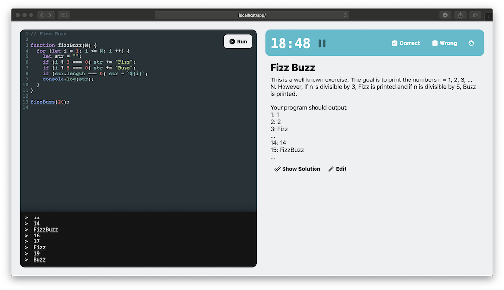

# Trainer 💪

Practice for coding interviews.

---

This little web-app allows you to practice for coding interviews in a fun
and interactive environment. It works like a flashcard box: Once you solve
a problem, you will have to solve it again after a week, then after two
weeks, etc...

Trainer works with multiple users, who will share their problems with each
other automatically.

## Architecture

The web interface uses CodeMirror and built-in libraries, the server is
written in Go and uses a SQLite database for persistence. As the web
interface uses quite modern apis, the app will probably only work in modern
browsers.

To run, I recommend Docker and Docker-Compose:

    docker-compose up --build
